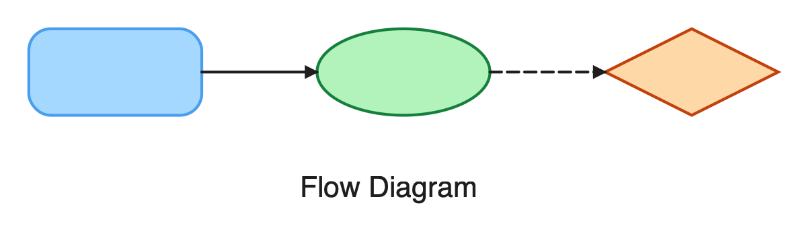

# excalidraw-render

[](https://github.com/shivama205/excalidraw-render/actions/workflows/ci.yml)
[](https://pypi.org/project/excalidraw-render/)
[](https://pypi.org/project/excalidraw-render/)
[](LICENSE)
[](https://github.com/willianjusten/awesome-svg)

Clean, deterministic, browser-free renderer for `.excalidraw` files. Pure Python + cairosvg. No Node, no headless browser, no `node-canvas`.



```bash
pip install excalidraw-render

excalidraw-render diagram.excalidraw                    # → diagram.png
excalidraw-render diagram.excalidraw -f svg             # → diagram.svg
excalidraw-render diagram.excalidraw -f pdf             # → diagram.pdf (vector)
excalidraw-render diagram.excalidraw --width 1200       # PNG at 1200px wide
excalidraw-render ./docs/                               # batch: every .excalidraw → .png
excalidraw-render ./docs/ --watch                       # re-render on every save
```

## Why this exists

The Excalidraw ecosystem's existing exporters either need Node + `node-canvas` ([`excalidraw_export`](https://www.npmjs.com/package/excalidraw_export)) or a headless browser running React ([`@excalidraw/excalidraw`](https://www.npmjs.com/package/@excalidraw/excalidraw)). Both are heavy, fragile in CI, and slow to start.

`excalidraw-render` is Python + cairosvg. Single-digit-megabyte install, instant startup, no native canvas libs, no Chromium. Useful for:

- **Static-site generators** (Hugo, MkDocs, Sphinx) baking `.excalidraw` to PNG at build time
- **CI/screenshot pipelines** where pulling Chromium is overkill
- **Doc + slide generators** that want predictable, deterministic vector output
- **Terminal viewers** (Kitty, iTerm2, Sixel) — on the roadmap

## Trade-off: no hand-drawn style

Excalidraw's signature squiggly look comes from [`roughjs`](https://roughjs.com/), a JavaScript library with no native Python port. `excalidraw-render` produces **clean vector output** instead. This is a deliberate trade-off — clean output is what most doc / slide / report pipelines actually want, and skipping roughjs removes the heaviest dependency.

A pure-Python roughjs port (`pyroughjs`) is on the roadmap. Until then, if you need the hand-drawn look, use Excalidraw's official export.

## Comparison

| | `excalidraw-render` | [`excalidraw_export`](https://www.npmjs.com/package/excalidraw_export) | [`@excalidraw/excalidraw`](https://www.npmjs.com/package/@excalidraw/excalidraw) |
|---|---|---|---|
| Language | Python | Node | React + Node |
| Hand-drawn (roughjs) | No (planned) | Yes | Yes |
| PNG output | Yes | via `rsvg-convert` | Yes |
| SVG output | Yes | Yes | Yes |
| PDF output | Yes | via `rsvg-convert` | No |
| Headless browser needed | No | No | Yes |
| Native canvas / image libs | No | Yes (`node-canvas`) | No |
| Install size | ~10 MB | ~150 MB | Depends |
| Batch / watch mode | Yes | No | No |
| Terminal protocols | Planned (iTerm / Kitty / Sixel) | No | No |

## Install

```bash
pip install excalidraw-render
```

On Linux you may need `libcairo2`:
```bash
sudo apt-get install libcairo2          # Debian / Ubuntu
sudo dnf install cairo                  # Fedora
sudo pacman -S cairo                    # Arch
```

On macOS, Cairo is typically already present via Homebrew. If not:
```bash
brew install cairo
```

## Usage

### CLI

```bash
# Single file → PNG next to source
excalidraw-render diagram.excalidraw

# Specify output + format
excalidraw-render diagram.excalidraw -o /tmp/out.svg -f svg

# Higher resolution PNG
excalidraw-render diagram.excalidraw --width 1600

# Or scale instead of fixed width
excalidraw-render diagram.excalidraw --scale 2.0

# Transparent background
excalidraw-render diagram.excalidraw --no-background

# Vector PDF / compressed JPEG
excalidraw-render diagram.excalidraw -f pdf
excalidraw-render diagram.excalidraw -f jpg --quality 85

# Batch mode: every .excalidraw in a directory
excalidraw-render ./docs/diagrams/ -o ./public/diagrams/

# Watch mode: re-render on every save (single file or directory)
excalidraw-render ./docs/diagrams/ --watch
```

### Python API

```python
from excalidraw_render.render import load_scene, render_svg, render_png, render_pdf, render_jpg

scene = load_scene("diagram.excalidraw")

# SVG as a string
svg = render_svg(scene)

# PNG to a file
render_png(scene, "diagram.png", width=1200)

# Vector PDF / JPEG
render_pdf(scene, "diagram.pdf")
render_jpg(scene, "diagram.jpg", quality=85)

# PNG to a binary stream
import io
buf = io.BytesIO()
render_png(scene, buf, scale=2.0)
```

## What's supported

**Formats:** PNG, SVG, vector PDF, JPEG.
**Elements:** rectangle, ellipse, diamond, arrow, line, text, freedraw, image, frame.
**Arrowheads:** `arrow`, `triangle`, `triangle_outline`, `bar`, `dot`, `diamond`, `diamond_outline`, `crowfoot_one`, `crowfoot_many`, `crowfoot_one_or_many`.
**Styling:** stroke color/width, fill color, stroke style (solid/dashed/dotted), opacity, per-element rotation.
**Text:** multi-line, text-align (left/center/right), vertical-align (top/middle/bottom), Excalidraw font families mapped to web-safe fonts. Container-bound text (labels inside rectangles, ellipses, diamonds) is positioned with Excalidraw's own padding-aware layout algorithm and rotates with its container.
**Freedraw:** smooth path via Catmull-Rom → cubic Bezier conversion.
**Image:** embedded raster data from the scene's `files` dict.
**Frame:** dashed boundary box with optional label.

Coverage matrix: [`docs/elements.md`](docs/elements.md).

## What's not supported yet

Documented in [`CHANGELOG.md`](CHANGELOG.md). Highlights:

- Roughness / hand-drawn look (needs roughjs port)
- Hachure / cross-hatch / zigzag / dots fill patterns (currently fall back to solid)
- Terminal output (iTerm / Kitty / Sixel)
- Markdown preprocessor subcommand

## Contributing

This is pre-alpha and breaking changes between minor versions are likely until v1.0. Issues, ideas, and PRs welcome — please file at https://github.com/shivama205/excalidraw-render/issues.

Local dev:
```bash
git clone https://github.com/shivama205/excalidraw-render
cd excalidraw-render
python -m venv .venv && .venv/bin/pip install -e ".[dev]"
.venv/bin/pytest
.venv/bin/ruff check src tests
.venv/bin/mypy src
```

## License

MIT — see [LICENSE](LICENSE).
